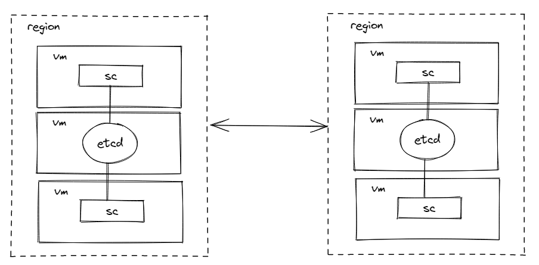

# 指导手册

## 1. Service-Center注册中心

### 1.1 SC的下载

下载地址：

https://github.com/apache/servicecomb-service-center/releases

下载最新的 2.1.0 版本（根据自身OS选择合适的软件包），下载后可直接运行。

```sh
# 第一步
start-service-center.sh (Linux/Mac) / start-service-center.bat(Windows)
# 第二步
start-frontend.sh(Linux/Mac) / start-frontend.bat(Windows)
```

 前段访问页面：http://127.0.0.1:30103/


> 这边使用内置的 db 所以可直接使用

---

### 1.2  etcd 高可用集群搭建

这边可参考官方文档：

https://etcd.io/docs/v3.5/op-guide/clustering/

https://etcd.io/docs/v3.5/op-guide/security/

https://blog.51cto.com/mageedu/2699744

### 1.3 二进制编译

一、前提：配置好go sdk，下载地址：https://go.dev/dl/

二、下载代码库

> https://github.com/apache/servicecomb-service-center.git

三、解决依赖

`go module` 是go语言从1.11版本之后官方推出的版本管理工具。

proxy代理设置：https://goproxy.cn/

```go
# Download the modules
GO111MODULE=on 
go mod download
```

四、编译

```go
go build -o service-center github.com/apache/servicecomb-service-center/cmd/scserver
```

> GO可以跨平台编译，重点关注
>
> GOOS=windows //程序构建环境目前OS
>
> GOARCH=amd64 //程序构建环境的目标计算架构

### 1.4 API信息

地址：https://github.com/apache/servicecomb-service-center/blob/master/docs/openapi/v4.yaml

### 1.5 更多资料

可以查看使用手册以及官网的readme：

1.https://service-center.readthedocs.io/en/latest/

2.https://github.com/apache/servicecomb-service-center

## 2. Sermant

### 1.1 Sermant的下载

### 1.2 注册中心插件介绍文档

https://github.com/huaweicloud/Sermant/blob/develop/docs/user-guide/register/document.md

## 3. 演示

### 3.1 安装概述


### 3.2 安装前准备


### 3.3 安装操作


### 3.4 安装后验证


### 3.1 sc部署



由于资源有限，etcd 没有安装集群。