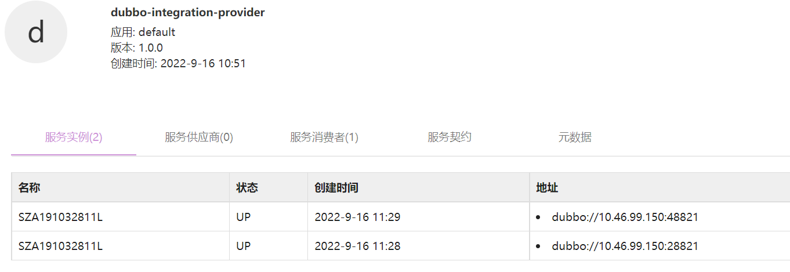
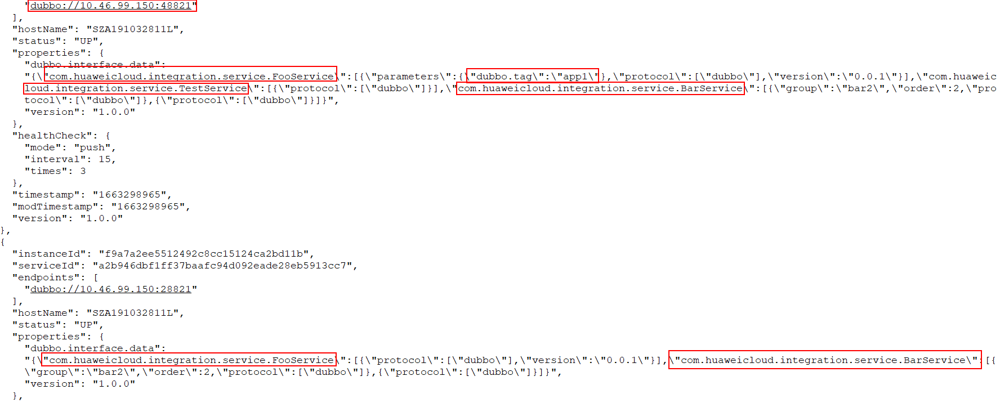
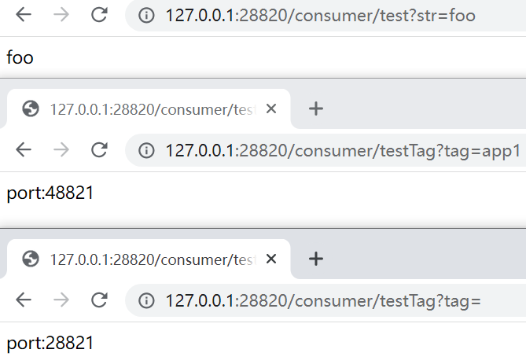

# 指导手册

## 1. Service-Center注册中心

### 1.1 SC的下载

下载地址：

https://github.com/apache/servicecomb-service-center/releases

下载最新的 2.1.0 版本（根据自身OS选择合适的软件包），下载后可直接运行。

```sh
# 第一步
start-service-center.sh (Linux/Mac) / start-service-center.bat(Windows)
# 第二步
start-frontend.sh(Linux/Mac) / start-frontend.bat(Windows)
```

 前段访问页面：http://127.0.0.1:30103/


> 这边使用内置的 db 所以可直接使用

---

### 1.2  etcd 高可用集群搭建

这边可参考官方文档：

https://etcd.io/docs/v3.5/op-guide/clustering/

https://etcd.io/docs/v3.5/op-guide/security/

https://blog.51cto.com/mageedu/2699744

### 1.3 二进制编译

一、前提：配置好go sdk，下载地址：https://go.dev/dl/

二、下载代码库

> https://github.com/apache/servicecomb-service-center.git

三、解决依赖

`go module` 是go语言从1.11版本之后官方推出的版本管理工具。

proxy代理设置：https://goproxy.cn/

```go
# Download the modules
GO111MODULE=on 
go mod download
```

四、编译

```go
go build -o service-center github.com/apache/servicecomb-service-center/cmd/scserver
```

> GO可以跨平台编译，重点关注
>
> GOOS=windows //程序构建环境目前OS
>
> GOARCH=amd64 //程序构建环境的目标计算架构

### 1.4 API信息

地址：https://github.com/apache/servicecomb-service-center/blob/master/docs/openapi/v4.yaml

### 1.5 更多资料

可以查看使用手册以及官网的readme：

1.https://service-center.readthedocs.io/en/latest/

2.https://github.com/apache/servicecomb-service-center

## 2. Sermant

### 1.1 Sermant的下载

https://github.com/huaweicloud/Sermant/releases


### 1.2 编译构建

- 编译机器需具备[git](https://git-scm.com/downloads) ,[jdk 8或11](https://www.oracle.com/java/technologies/downloads/) ,[maven](https://maven.apache.org/download.cgi) 环境
- 执行`git clone -b develop https://github.com/huaweicloud/Sermant.git` 克隆最新源码
- 执行`cd Sermant`进入源码目录
- 执行`mvn clean package -Dmaven.test.skip -Pexample` 编译示例项目


### 1.3 注册中心插件介绍文档

https://github.com/huaweicloud/Sermant/blob/develop/docs/user-guide/register/document.md

详细信息见官方文档:https://github.com/huaweicloud/Sermant

## 3. 演示

### 3.1 安装概述

#### 3.1.1 部署拓扑


* sc 为注册中心，本组件为无状态服务，可根据系统规模部署多个
* etcd 高可用集群至少需要 3 个节点

按照上述的部署拓扑需要 8 台vm。

#### 3.1.2 安装流程


### 3.2 安装前准备

#### 3.2.1 准备环境

我这边是个人机子安装了虚拟机。由于我这边个人机子资源有限，只申请了 6 台虚拟机。

OS: Centos 7


| vm-ip          | 域       |
| -------------- | -------- |
| 192.168.81.128 | region-1 |
| 192.168.81.129 | region-1 |
| 192.168.81.130 | region-1 |
| 192.168.81.131 | region-2 |
| 192.168.81.132 | region-2 |
| 192.168.81.133 | region-2 |

#### 3.2.2 获取软件包

> etcd 根据要求获取相应版本建议3xx，我这边使用了最新的版本。

* SC：https://github.com/apache/servicecomb-service-center/releases
* ETCD：https://github.com/etcd-io/etcd/releases


### 3.3 安装操作

#### 3.3.1 安装 etcd

> https://etcd.io/docs/v3.5/op-guide/clustering/
>
> 这边需要**注意**：如果你机子单独有固态盘的话，可以把 etcd 安装在固态上，提高性能。

**region-1**

```sh
前提：包已经上传到虚拟机的制定目录，并解压

进入3 台 etcd 所在目录，执行（这一块可以由systemd去维护）,需要创建下数据以及日志存放的位置。

./etcd --name=etcd-01 \
--data-dir=/var/lib/etcd/default.etcd \
--log-outputs=/var/lib/etcd/log \
--listen-client-urls=http://192.168.81.128:2379,http://127.0.0.1:2379 \
--advertise-client-urls=http://192.168.81.128:2379 \
--listen-peer-urls=http://192.168.81.128:2380 \
--initial-advertise-peer-urls=http://192.168.81.128:2380 \
--initial-cluster-token=etcd-cluster \
--initial-cluster etcd-01=http://192.168.81.128:2380,etcd-02=http://192.168.81.129:2380,etcd-03=http://192.168.81.130:2380 \
--initial-cluster-state new 


./etcd --name=etcd-02 \
--data-dir=/var/lib/etcd/default.etcd \
--log-outputs=/var/lib/etcd/log \
--listen-client-urls=http://192.168.81.129:2379,http://127.0.0.1:2379 \
--advertise-client-urls=http://192.168.81.129:2379 \
--listen-peer-urls=http://192.168.81.129:2380 \
--initial-advertise-peer-urls=http://192.168.81.129:2380 \
--initial-cluster-token=etcd-cluster \
--initial-cluster etcd-01=http://192.168.81.128:2380,etcd-02=http://192.168.81.129:2380,etcd-03=http://192.168.81.130:2380 \
--initial-cluster-state new 

./etcd --name=etcd-03 \
--data-dir=/var/lib/etcd/default.etcd \
--log-outputs=/var/lib/etcd/log \
--listen-client-urls=http://192.168.81.130:2379,http://127.0.0.1:2379 \
--advertise-client-urls=http://192.168.81.130:2379 \
--listen-peer-urls=http://192.168.81.130:2380 \
--initial-advertise-peer-urls=http://192.168.81.130:2380 \
--initial-cluster-token=etcd-cluster \
--initial-cluster etcd-01=http://192.168.81.128:2380,etcd-02=http://192.168.81.129:2380,etcd-03=http://192.168.81.130:2380 \
--initial-cluster-state new 

```

可以通过etcd --help查看启动参数说明

**如何检验etcd集群是否安装成功**

```sh
./etcdctl --endpoints=http://192.168.81.128:2379 endpoint  status --cluster -w table
```


看上图可知，ip为192.168.81.128节点选为 leader。

---

**region-2**

```sh
./etcd --name=etcd-01 \
--data-dir=/var/lib/etcd/default.etcd \
--log-outputs=/var/lib/etcd/log \
--listen-client-urls=http://192.168.81.131:2379,http://127.0.0.1:2379 \
--advertise-client-urls=http://192.168.81.131:2379 \
--listen-peer-urls=http://192.168.81.131:2380 \
--initial-advertise-peer-urls=http://192.168.81.131:2380 \
--initial-cluster-token=etcd-cluster \
--initial-cluster etcd-01=http://192.168.81.131:2380,etcd-02=http://192.168.81.132:2380,etcd-03=http://192.168.81.133:2380 \
--initial-cluster-state new 

./etcd --name=etcd-02 \
--data-dir=/var/lib/etcd/default.etcd \
--log-outputs=/var/lib/etcd/log \
--listen-client-urls=http://192.168.81.132:2379,http://127.0.0.1:2379 \
--advertise-client-urls=http://192.168.81.132:2379 \
--listen-peer-urls=http://192.168.81.132:2380 \
--initial-advertise-peer-urls=http://192.168.81.132:2380 \
--initial-cluster-token=etcd-cluster \
--initial-cluster etcd-01=http://192.168.81.131:2380,etcd-02=http://192.168.81.132:2380,etcd-03=http://192.168.81.133:2380 \
--initial-cluster-state new 

./etcd --name=etcd-03 \
--data-dir=/var/lib/etcd/default.etcd \
--log-outputs=/var/lib/etcd/log \
--listen-client-urls=http://192.168.81.133:2379,http://127.0.0.1:2379 \
--advertise-client-urls=http://192.168.81.133:2379 \
--listen-peer-urls=http://192.168.81.133:2380 \
--initial-advertise-peer-urls=http://192.168.81.133:2380 \
--initial-cluster-token=etcd-cluster \
--initial-cluster etcd-01=http://192.168.81.131:2380,etcd-02=http://192.168.81.132:2380,etcd-03=http://192.168.81.133:2380 \
--initial-cluster-state new 
```

查询：

```sh
./etcdctl --endpoints=https://192.168.81.131:2379 endpoint  status --cluster -w table
```


#### 3.3.2 安装 ServiceCenter

> 确保这边获取的是SC，2.1.0版本的包。


如上图，包解压后包含的一些内容，首先需要配置修改 conf 目录中的文件，启动 `start-service-center.sh` 和 `start-frontend.sh`

---

修改`conf`中的文件

`app.conf`


修改 frontend_host_ip 和 httpaddr，为本级的 ip 地址。

`app.yaml`


修改 

1.server.host

2.REGISTRY_KIND

3.REGISTRY_ETCD_CLUSTER_NAME

4.REGISTRY_ETCD_CLUSTER_MANAGER_ENDPOINTS

5.REGISTRY_ETCD_CLUSTER_ENDPOINTS

6.registry.instance.datacenter.name

7.registry.instance.datacenter.region

8.registry.instance.datacenter.availableZone

> 注意 region-1 这几个节点配置一样，region-2这边几个节点配置一样

`chassis.yaml`


修改 listenAddress 为本机的 ip 地址。

`syncer.yaml`


开启 enableOnStart 开关，以及修改endpoints，region-2中的sc机子ip。

**新增——修改白名单**：指定服务同步。这边描述一下如果要同步所有服务则在rules 使用"*"，如果设置为 sync带星，则会同步以sync为前缀的服务。 


**重复上述操作，去修改其他机子上的 sc 的配置**。

然后在各个机子上运行

`start-service-center.sh` 和 `start-frontend.sh`

打开随意一个节点的前端界面：

http://192.168.81.128:30103/

> 这边展示的是同步所有的服务！！！即设置 rules 为 "*"


### 3.4 安装后验证

#### 3.4.1 同步所有的服务

> 同步所有的服务即把 rules 设置为"*"

检查是否健康

curl -k http://192.168.81.128:30100/health


```yaml
{
    "instances": [
        {
            "instanceId": "b40ce99b3bfe4950879d412718117581",
            "serviceId": "b87ed41a0690049986ba8983b16a2f6c17a1d61f",
            "endpoints": [
                "rest://0.0.0.0:30100/"
            ],
            "hostName": "etcd01",
            "status": "UP",
            "healthCheck": {
                "mode": "push",
                "interval": 30,
                "times": 3
            },
            "timestamp": "1650364125",
            "dataCenterInfo": {
                "name": "dz1",
                "region": "rg1",
                "availableZone": "az1"
            },
            "modTimestamp": "1650364125",
            "version": "2.1.0"
        },
        {
            "instanceId": "b40ce99b3bfe4950879d412718117582",
            "serviceId": "b87ed41a0690049986ba8983b16a2f6c17a1d62f",
            "endpoints": [
                "rest://0.0.0.0:30100/"
            ],
            "hostName": "etcd02",
            "status": "UP",
            "healthCheck": {
                "mode": "push",
                "interval": 30,
                "times": 3
            },
            "timestamp": "1650364125",
            "dataCenterInfo": {
                "name": "dz1",
                "region": "rg1",
                "availableZone": "az1"
            },
            "modTimestamp": "1650364125",
            "version": "2.1.0"
        },
        {
            "instanceId": "b40ce99b3bfe4950879d412718117583",
            "serviceId": "b87ed41a0690049986ba8983b16a2f6c17a1d63f",
            "endpoints": [
                "rest://0.0.0.0:30100/"
            ],
            "hostName": "etcd03",
            "status": "UP",
            "healthCheck": {
                "mode": "push",
                "interval": 30,
                "times": 3
            },
            "timestamp": "1650364125",
            "dataCenterInfo": {
                "name": "dz1",
                "region": "rg1",
                "availableZone": "az1"
            },
            "modTimestamp": "1650364125",
            "version": "2.1.0"
        },
        {
            "instanceId": "b40ce99b3bfe4950879d412718117584",
            "serviceId": "b87ed41a0690049986ba8983b16a2f6c17a1d64f",
            "endpoints": [
                "rest://0.0.0.0:30100/"
            ],
            "hostName": "etcd04",
            "status": "UP",
            "healthCheck": {
                "mode": "push",
                "interval": 30,
                "times": 3
            },
            "timestamp": "1650364125",
            "dataCenterInfo": {
                "name": "dz2",
                "region": "rg2",
                "availableZone": "az2"
            },
            "modTimestamp": "1650364125",
            "version": "2.1.0"
        },
        {
            "instanceId": "b40ce99b3bfe4950879d412718117585",
            "serviceId": "b87ed41a0690049986ba8983b16a2f6c17a1d65f",
            "endpoints": [
                "rest://0.0.0.0:30100/"
            ],
            "hostName": "etcd05",
            "status": "UP",
            "healthCheck": {
                "mode": "push",
                "interval": 30,
                "times": 3
            },
            "timestamp": "1650364125",
            "dataCenterInfo": {
                "name": "dz2",
                "region": "rg2",
                "availableZone": "az2"
            },
            "modTimestamp": "1650364125",
            "version": "2.1.0"
        },
        {
            "instanceId": "b40ce99b3bfe4950879d412718117586",
            "serviceId": "b87ed41a0690049986ba8983b16a2f6c17a1d66f",
            "endpoints": [
                "rest://0.0.0.0:30100/"
            ],
            "hostName": "etcd06",
            "status": "UP",
            "healthCheck": {
                "mode": "push",
                "interval": 30,
                "times": 3
            },
            "timestamp": "1650364125",
            "dataCenterInfo": {
                "name": "dz2",
                "region": "rg2",
                "availableZone": "az2"
            },
            "modTimestamp": "1650364125",
            "version": "2.1.0"
        }
    ]
}
```


如上图所示，请求创建一个服务，创建成功后以及同步到另外一个 region 了。

#### 3.4.2 同步指定服务

> 这边白名单指定了同步服务的前缀名
>
> 修改 conf 中的 syncer.yaml 文件

```yaml
whitelist:
    service:
      # usage for example "sync*"
      rules:
        - "sync*"
```


### 3.5 使用Sermant

这边准备好zookeeper。

> 注意：之前版本需要backend，现在最新版本 backend 仅供选择，可以有也可以没有


Sermant可以自己编包，或者去 [release](https://github.com/huaweicloud/Sermant/releases) 边下载。目前 Sermant 已经发布了 0.3.0 版本

zk[下载地址](http://archive.apache.org/dist/zookeeper/)。也可以到我这边的guide去下载包，这边的包会更加新一点，是我个人出包，可以理解会比社区快一点。


#### 3.5.1 文档资料

注册文档：https://github.com/huaweicloud/Sermant/blob/develop/docs/user-guide/registry/document.md

dubbo注册迁移文档：https://github.com/huaweicloud/Sermant/blob/develop/docs/user-guide/registry/dubbo-registry-migiration.md

#### 3.5.2 对接Nacos

**前提**: 

1.已经部署好了nacos

2.编译好了 [demo 应用](https://github.com/huaweicloud/Sermant/tree/develop/sermant-plugins/sermant-service-registry/demo-registry/demo-registry-dubbo)

> 这个Dubbo的demo应用本身就对接了nacos
>
> ```yaml
> registry:
>   # 模拟存量dubbo应用注册到nacos的情况，新开发的应用建议配置为 sc://127.0.0.1:30100
>   address: nacos://127.0.0.1:8848
> ```

---

步骤一: 部署 provider

```java
# 若application.yaml中已经配置了dubbo地址则这个参数（Ddubbo.registry.address）可以不用写
java -Ddubbo.registry.address=nacos://192.168.81.128:8848 -jar dubbo-provider.jar
```


步骤二：部署consumer

```java
java -Ddubbo.registry.address=nacos://192.168.81.128:8848 -jar dubbo-consumer.jar
```


步骤三：验证

```http
http://192.168.81.128:28020/test
```


#### 3.5.3 对接 sc

> 原先应用已经对接了 Nacos，现在对接到 SC 上

修改配置地址


```yaml
servicecomb.service:
	# 修改了
  address: http://192.168.81.128:30100 #注册中心地址
  heartbeatInterval: 15 #服务实例心跳发送间隔（单位：秒）
  openMigration: false #是否开启迁移功能
  enableSpringRegister: false #是否开启spring插件注册能力
  # 修改了
  enableDubboRegister: true #是否开启dubbo插件注册能力
  sslEnabled: false # 是否开启ssl
```

**步骤一**：部署provider

```java
# 若注册插件的配置已经配置了 enableDubboRegister: true 则启动不需要加-Dservicecomb.service.enableDubboRegister参数
    
java -Dservicecomb.service.enableDubboRegister=true -javaagent:/root/sermant/sermant-agent/agent/sermant-agent.jar=appName=dubbo-provider -jar dubbo-provider.jar
```

**步骤二**：部署consumer

```java
# 若注册插件的配置已经配置了 enableDubboRegister: true 则启动不需要加-Dservicecomb.service.enableDubboRegister参数

java -Dservicecomb.service.enableDubboRegister=true -javaagent:/root/sermant/sermant-agent/agent/sermant-agent.jar=appName=dubbo-consumer -jar dubbo-consumer.jar 
```

**步骤三**：测试

```http
http://192.168.81.128:28020/test
```


---

 将服务名修改成 sync 前缀开头

```yaml
server:
  port: 28020
dubbo:
  application:
    name: sync-consumer
  protocol:
    port: 28820
  registry:
    # 模拟存量dubbo应用注册到nacos的情况，新开发的应用建议配置为 sc://127.0.0.1:30100
    address: nacos://127.0.0.1:8848    
---
server:
  port: 28021
dubbo:
  application:
    name: sync-provider
  protocol:
    port: 28821
  registry:
    # 模拟存量dubbo应用注册到nacos的情况，新开发的应用建议配置为 sc://127.0.0.1:30100
    address: nacos://127.0.0.1:8848
```

**步骤一**：部署provider

```java
# 若注册插件的配置已经配置了 enableDubboRegister: true 则启动不需要加-Dservicecomb.service.enableDubboRegister参数
  
java -Dservicecomb.service.enableDubboRegister=true -javaagent:/root/sermant/sermant-agent/agent/sermant-agent.jar=appName=dubbo-provider -jar dubbo-provider.jar
```

**步骤二**：部署consumer

```java
# 若注册插件的配置已经配置了 enableDubboRegister: true 则启动不需要加-Dservicecomb.service.enableDubboRegister参数

java -Dservicecomb.service.enableDubboRegister=true -javaagent:/root/sermant/sermant-agent/agent/sermant-agent.jar=appName=dubbo-consumer -jar dubbo-consumer.jar 
```

**步骤三**：测试

```http
http://192.168.81.128:28020/test
```


已经同步到另外一个region了。

nacos 这边没注册上。


#### 3.5.2 双注册

详细见文档：https://github.com/huaweicloud/Sermant/blob/develop/docs/user-guide/registry/dubbo-registry-migiration.md

修改`${agent_package_path}/agent/pluginPackage/service-registry/config/config.yaml`


```yaml
servicecomb.service:
  # 修改地方
  address: http://192.168.81.128:30100 #注册中心地址
  heartbeatInterval: 15 #服务实例心跳发送间隔（单位：秒）
  # 修改地方
  openMigration: true #是否开启迁移功能
  enableSpringRegister: false #是否开启spring插件注册能力
  # 修改地方
  enableDubboRegister: true #是否开启dubbo插件注册能力
  sslEnabled: false # 是否开启ssl
```

**步骤一**：注册provider

```java
# 若注册插件的配置已经配置了 enableDubboRegister: true 则启动不需要加-Dservicecomb.service.enableDubboRegister参数

java -Ddubbo.registry.address=nacos://192.168.81.128:8848 -javaagent:/root/sermant/sermant-agent/agent/sermant-agent.jar=appName=dubbo-provider -jar dubbo-provider.jar 
```

**步骤二**：注册consumer

```java
# 若注册插件的配置已经配置了 enableDubboRegister: true 则启动不需要加-Dservicecomb.service.enableDubboRegister参数

java -Ddubbo.registry.address=nacos://192.168.81.128:8848 -javaagent:/root/sermant/sermant-agent/agent/sermant-agent.jar=appName=dubbo-consumer -jar dubbo-consumer.jar 
```

**步骤三**：验证

```http
http://192.168.81.128:28020/test
```


如上图所示已经同步成功。

---

## 4. 更新

注册中心 sc ：更新了指定服务同步的功能。——需要配置规则前缀

kill-9：下线时间长问题，由于之前agent创建实例使用的是pull方式（不对）这个方式实例健康检查对应的interval为30s，times为3是定死的，改成push模式。

Sermant：目前社区已经更新到v0.5.0，能力做了增强，不需要backend组件也行（可选）。

## 5. 遗留问题

1.新增接口需要修改版本号：

目前最新版service-center-client sdk已经去掉了这个校验，agent已使用最新版的sdk，每个实例发布的接口存入实例属性中，所以新增接口/删除接口时不需要更新版本号。

2.修改tag需要修改版本号：

agent已经把tag参数存入实例属性中，，所以修改tag时不需要更新版本号。

验证如下：

注册微服务如下图所示，其中包含2个实例：


实例信息如下，可以看出来，端口为48821的实例，存在com.huaweicloud.integration.service.FooService、com.huaweicloud.integration.service.TestService与com.huaweicloud.integration.service.BarService 3个接口，其中com.huaweicloud.integration.service.FooService配置了tag: app1，端口为28821的实例，存在com.huaweicloud.integration.service.FooService与com.huaweicloud.integration.service.BarService 2个接口：


测试结果如下图所示，消费者可以正常访问com.huaweicloud.integration.service.TestService接口，访问com.huaweicloud.integration.service.
FooService接口时，可以通过tag访问不同的实例：

